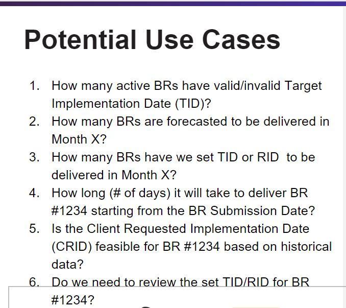

# Microsoft Hackaton - December 2023
Microsoft Hackaton Activity of December 2023

## Proof of concept idea

* **BITS** AI integration
  * we have access to API and can have subsets of data (or custom API calls created)
  * 

* **Archibus** AI integration
  * Limited API integration(?)
  * Could potentially have access to subsets of data(?)

## Resources

* [Azure OpenAI Chatbot (using cognitive search)](https://github.com/Azure-Samples/azure-search-openai-demo/tree/main)
* [Azure AI Studio Examples](https://github.com/azure-samples/azureai-samples)
* [Azure OpenAI Accelerators and Demo Assets](https://github.com/Azure/ai-solution-accelerators-list/tree/main/OpenAIDemos)
* [LLM Grounding](https://techcommunity.microsoft.com/t5/fasttrack-for-azure/grounding-llms/ba-p/3843857#:~:text=What%20is%20Grounding%3F,relevance%20of%20the%20generated%20output)
* [(Video) Quickly build and deploy OpenAI apps on Azure with your own data](https://www.youtube.com/watch?v=j8i-OM5kwiY)

### Cognitive Search

Retrival-Augmented Generation (RAG):


## Developpers

### file splitter

Drop the payload into the `data/` folder and then just run from the root of this project

```bash
python util/split _payload.by
```
Resulting files will end up in `output/` folder.

### setup virtual env

```bash
python3 -m venv .venv
source .venv/bin/activate
pip install -r util/requirements.txt --upgrade
```